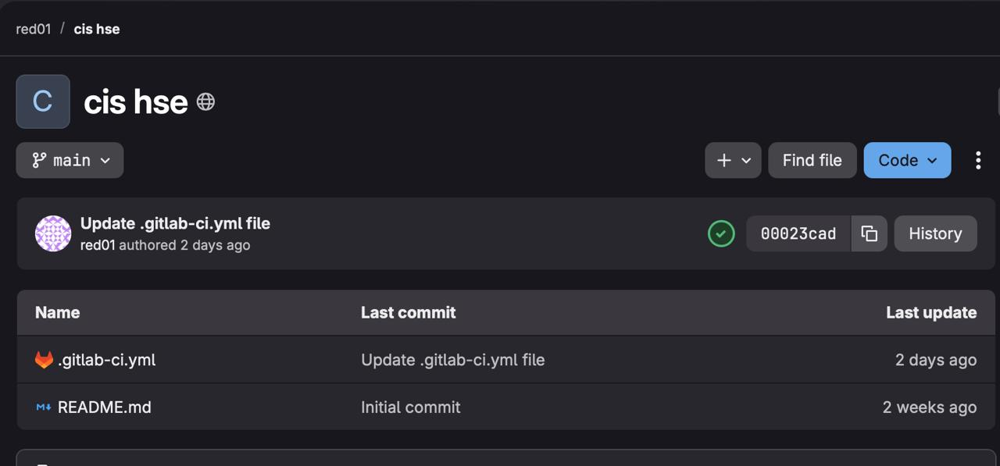
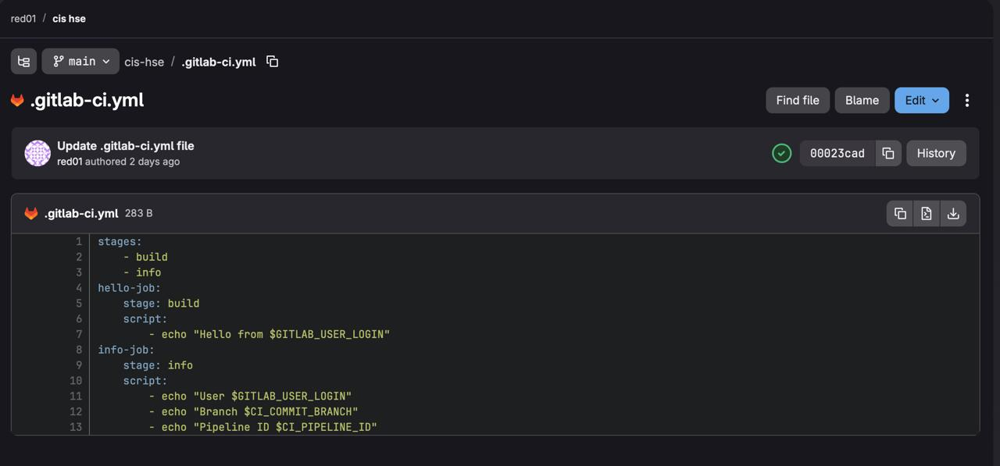
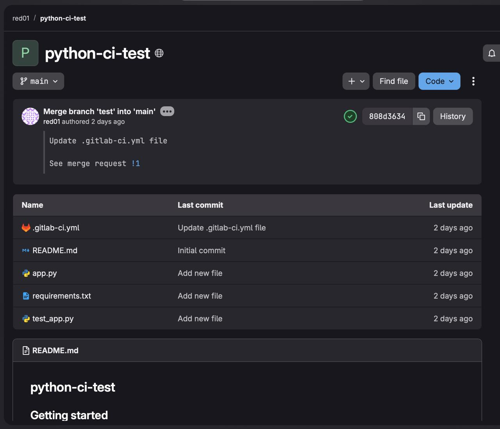
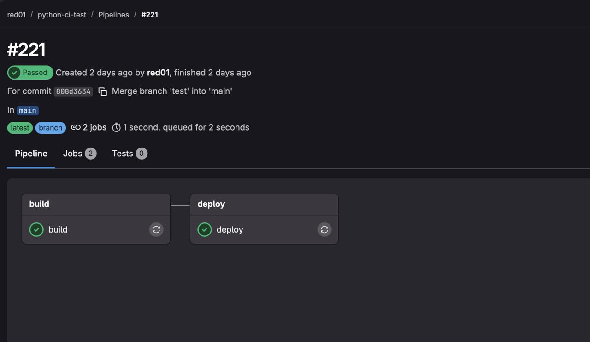
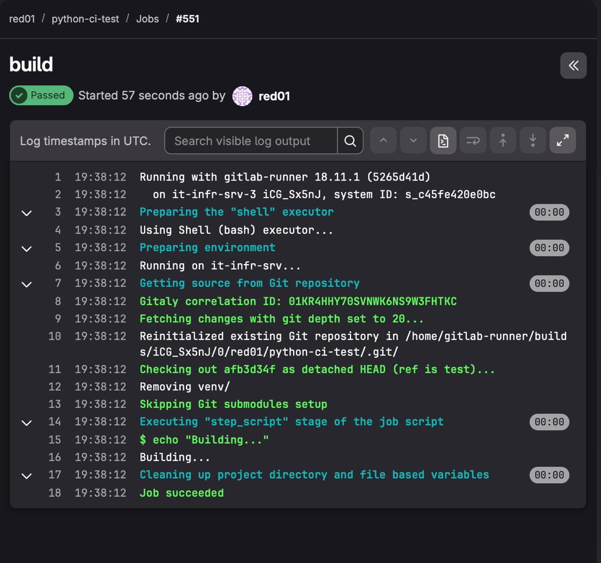
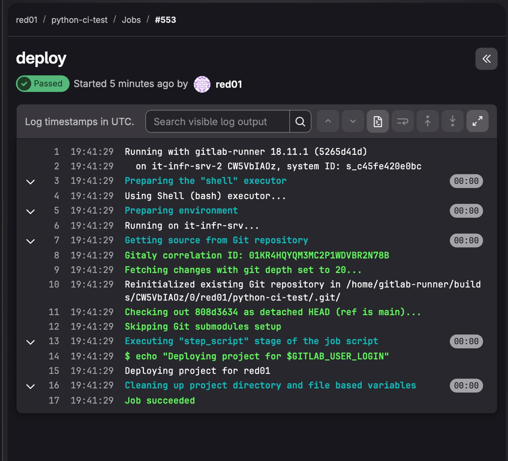

# Отчёт по практике: GitLab CI/CD Часть1

**Пользователь:** red01 (Нарышкина Анна Андреевна)  

---

## Задание 1. Hello CI + базовый pipeline

### Описание

Создан проект `hello-ci` в GitLab. В репозиторий добавлен файл `.gitlab-ci.yml` с одним job'ом `hello-job`, который выводит имя пользователя через переменную `$GITLAB_USER_LOGIN`. После коммита pipeline запустился автоматически и завершился успешно.

Дополнительно добавлен второй job - `info-job` в отдельном stage `info`, который выводит имя пользователя, название ветки (`$CI_COMMIT_BRANCH`) и идентификатор pipeline (`$CI_PIPELINE_ID`).

### Скриншоты





---

## Задание 2. Сборка и тестирование приложения

### Описание

Создан проект `python-ci-test`. В репозиторий добавлены файлы:
- `requirements.txt` - зависимость `pytest==7.4.0`
- `app.py` - функция `add(a, b)`, возвращающая сумму
- `test_app.py` - тест функции `add`
- `.gitlab-ci.yml` - двухэтапный pipeline: `install` (создание venv и установка зависимостей) и `test` (запуск pytest)

Артефакт `venv/` передаётся между job'ами через `artifacts`. Оба этапа завершились успешно, тест прошёл.

Затем создана ветка `test`, в которой `.gitlab-ci.yml` изменён: добавлен job `deploy` с условием `only: main`. При запуске pipeline в ветке `test` job `deploy` был пропущен (skipped). После создания Merge Request и слияния в `main` pipeline запустил оба job'а - `build` и `deploy`.

### Скриншоты









---

## Контрольные вопросы

**1. Что такое pipeline в GitLab?**

Pipeline - это автоматизированная последовательность задач (job'ов), которая запускается при событиях в репозитории (например, при коммите). Pipeline состоит из **stages** (этапов), которые выполняются последовательно, а внутри каждого stage job'ы могут выполняться параллельно. Описывается в файле `.gitlab-ci.yml`.

---

**2. Что такое job и stage?**

- **Job** - это конкретная задача: набор команд (`script`), которые выполняются в рамках pipeline. Например: `hello-job`, `test`, `deploy`.
- **Stage** - это этап pipeline, объединяющий один или несколько job'ов. Все job'ы одного stage выполняются параллельно, а сами stages выполняются строго последовательно.

Порядок выполнения job'ов определяется порядком объявления stages в секции `stages:`. Job без явного указания stage по умолчанию попадает в stage `test`.

---

**3. Как запускается pipeline?**

Pipeline в GitLab запускается автоматически в следующих случаях:
1. **При коммите в любую ветку** - самый частый случай: каждый `git push` или коммит через UI вызывает новый pipeline.
2. **При создании или слиянии Merge Request** - pipeline запускается для проверки изменений перед слиянием.
3. Также pipeline можно запустить вручную через **CI/CD → Pipelines → Run pipeline**.

---

**4. Что такое GitLab Runner?**

GitLab Runner - это агент (отдельная программа), который подключается к GitLab и фактически выполняет команды из job'ов. Когда pipeline запускается, GitLab ищет доступный runner и передаёт ему задачу.

Код из `.gitlab-ci.yml` выполняется **на машине, где установлен GitLab Runner** - это может быть отдельный сервер, виртуальная машина или контейнер. Runner изолирует каждый job в отдельной среде.

---

**5. Что такое переменные CI/CD?**

Переменные CI/CD - это именованные значения, автоматически доступные внутри скриптов job'ов. GitLab предоставляет набор встроенных переменных:

| Переменная | Значение |
|---|---|
| `$GITLAB_USER_LOGIN` | Логин пользователя, запустившего pipeline |
| `$CI_COMMIT_BRANCH` | Название ветки текущего коммита |
| `$CI_PIPELINE_ID` | Уникальный числовой ID pipeline |

Они используются для динамической настройки поведения pipeline: например, чтобы выводить имя пользователя в логах, использовать имя ветки для условного деплоя или передавать ID pipeline в уведомления.

---

**6. Можно ли переносить venv между job'ами через artifacts?**

Да, можно. В задании 2 это было продемонстрировано: job `install` создаёт виртуальное окружение `venv/` и объявляет его как артефакт:

```yaml
artifacts:
  paths:
    - venv/
```

GitLab сохраняет содержимое этой папки и передаёт её следующему job'у `test`, который использует `venv/bin/python` без повторной установки зависимостей. Это стандартный способ переноса файлов между job'ами в рамках одного pipeline.
