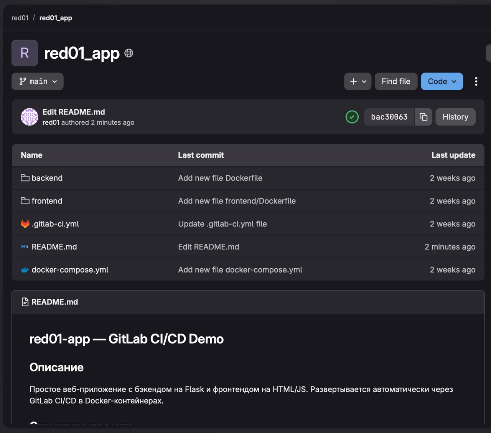
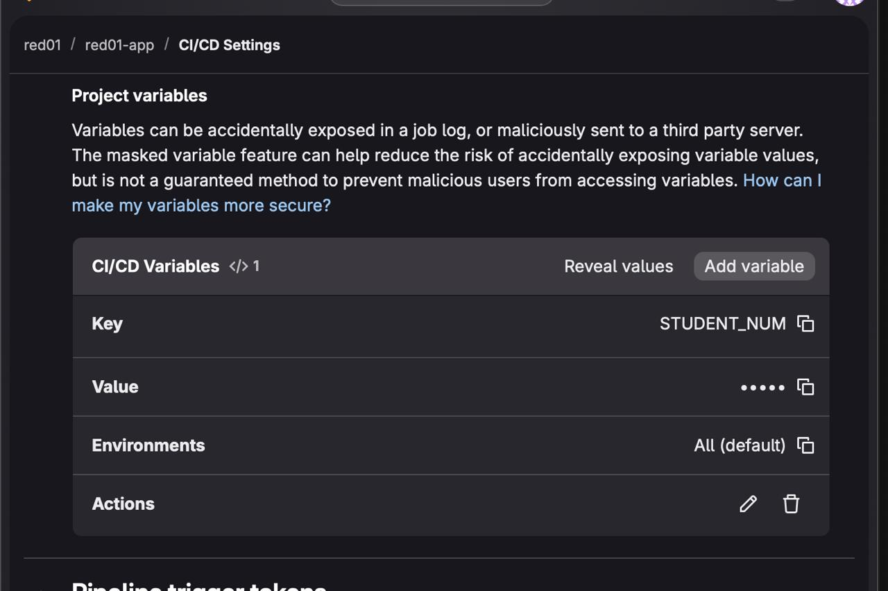

# Отчёт по практике: GitLab Задание 3

**Пользователь:** red01 (Нарышкина Анна Андреевна)

---

## Задание 3. Публикация приложения в GitLab и настройка CI/CD

### Описание

Репозиторий `ChallengeEverything/gitlab_ci` с GitHub склонирован на виртуальную машину:

```bash
git clone https://github.com/ChallengeEverything/gitlab_ci
```

В GitLab создан новый репозиторий `red01/gitlab_ci`. Для публикации использовался Personal Access Token и флаг `--mirror`, чтобы перенести все ветки и теги в исходном виде:

```bash
cd gitlab_ci
git remote set-url origin https://oauth2:<TOKEN>@gl-hse.gitlab.yandexcloud.net/red01/gitlab_ci.git
git push --mirror
```

Для работы pipeline настроена переменная CI/CD:
- Путь: **Settings - CI/CD - Variables - Add variable**
- **Key:** `STUDENT_NUM`
- **Value:** `01`
- **Protected:** выключено, **Masked:** выключено

После сохранения переменной pipeline запустился и завершился успешно.

### Скриншоты




