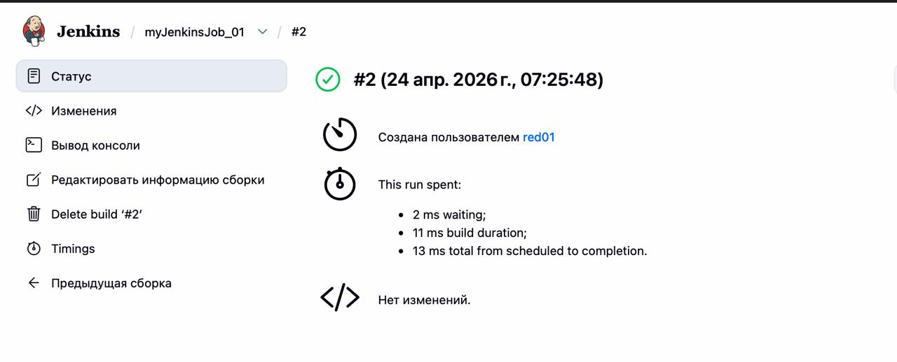
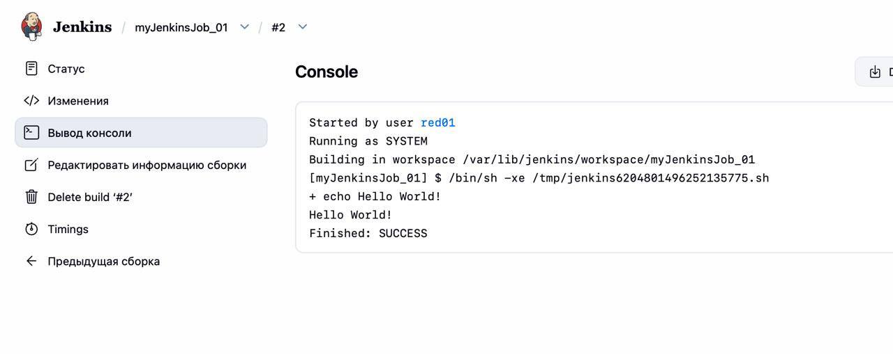
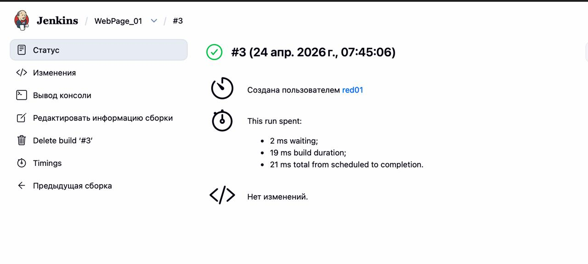
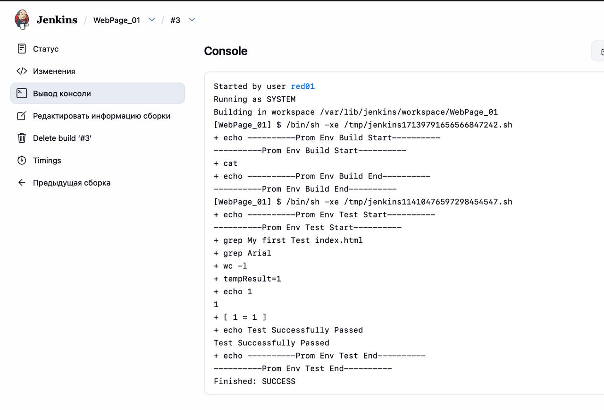
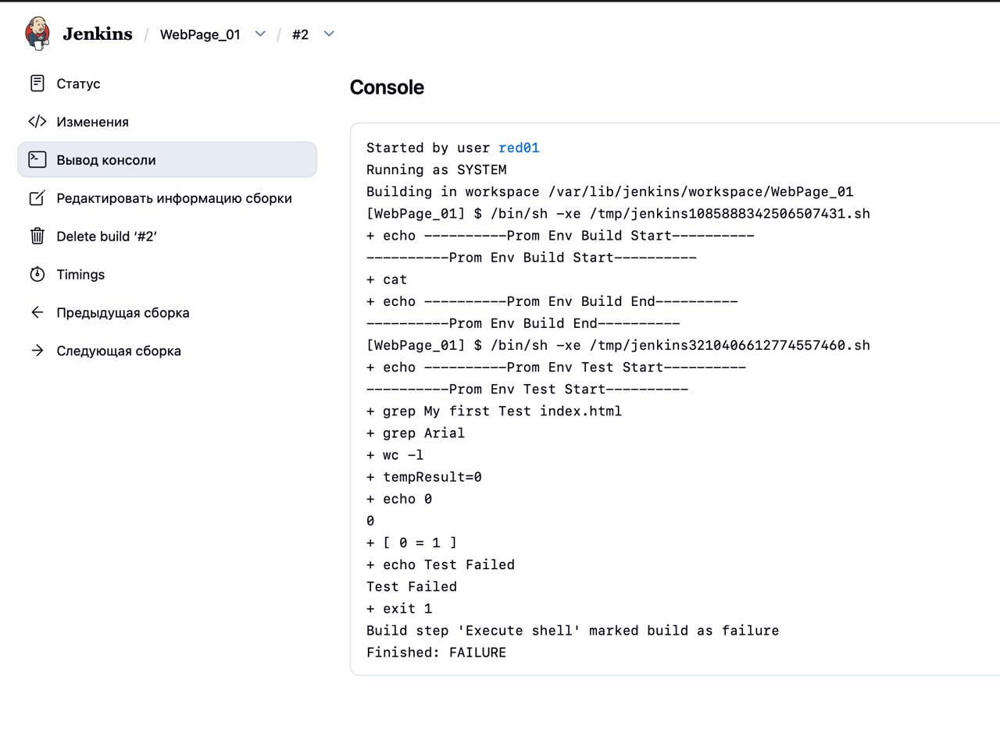
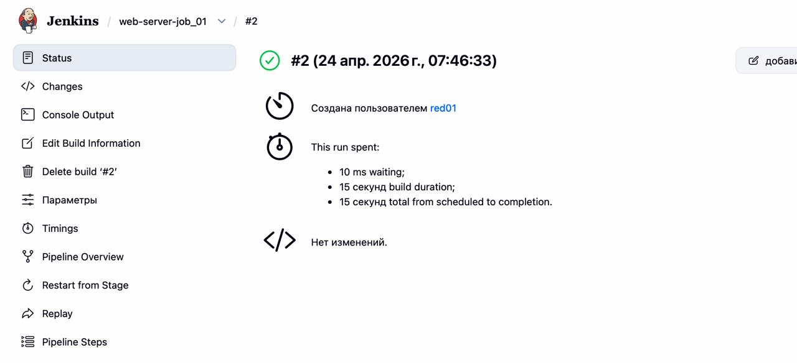
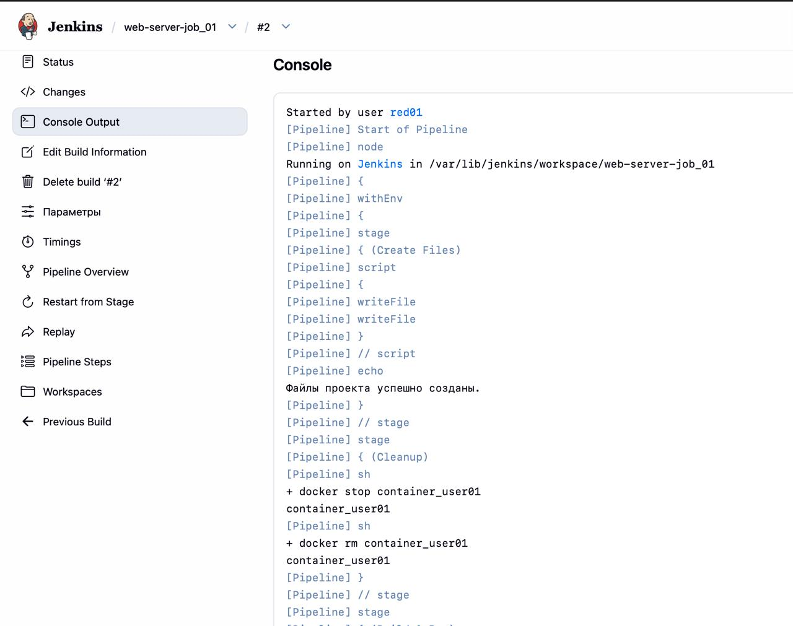
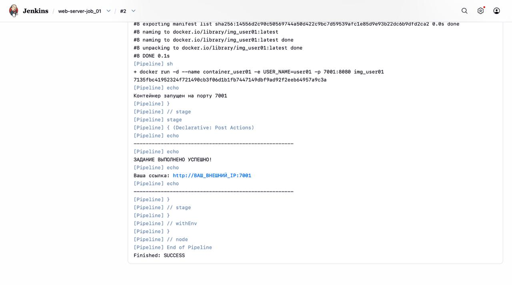
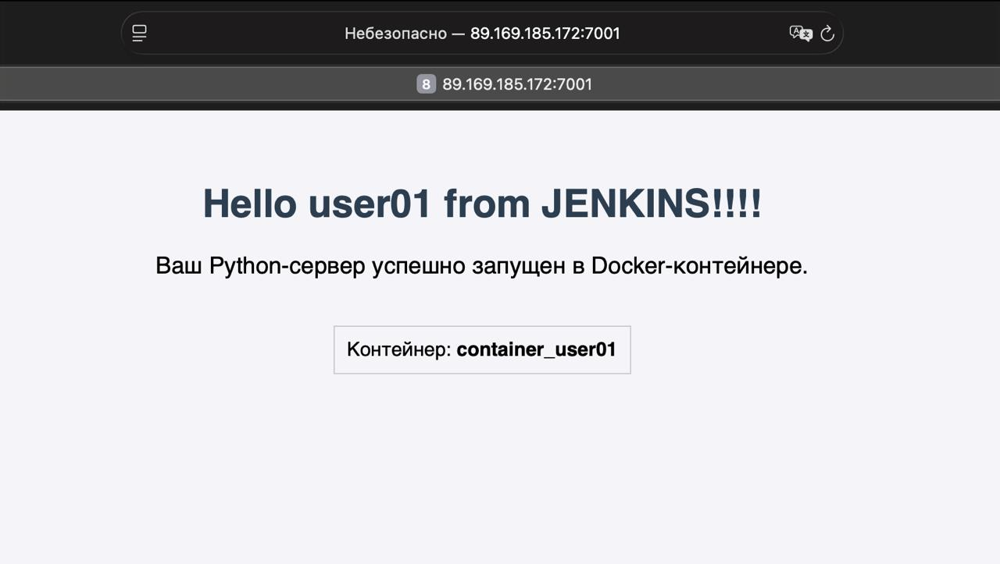

# Отчёт. Практика Jenkins

---

## Задание 1. Создание первого Job

Создан Freestyle-проект `myJenkinsJob_01` с описанием «My first Jenkins Job». В разделе Build Steps добавлен шаг Execute Shell со скриптом `echo "Hello World!"`. Job успешно запущен, в Console Output выведена строка `Hello World!`.

**Скриншот успешного запуска Job:**

**Console Output:**

---

## Задание 2. Создание веб-страницы

Создан Freestyle-проект `WebPage_01` с ротацией логов 5 дней. Добавлены два шага Execute Shell:
- первый генерирует файл `index.html`
- второй проверяет наличие в файле строки, содержащей слово `Arial`

При первом запуске тест прошёл успешно. После замены Arial на Test в первом шаге повторный запуск завершился ошибкой, так как условие поиска Arial перестало выполняться.

**Скриншот успешного запуска Job:**

**Console Output (успешный запуск):**

**Console Output (неуспешный запуск):**

---

## Задание 3. Развёртывание Python-сервера

Создан Pipeline-проект `web-server-job_01` с параметром `STUDENT_ID`. При запуске указан параметр 01. Pipeline состоит из трёх стадий:
- **Create Files** - генерация `app.py` и `Dockerfile`
- **Cleanup** - остановка и удаление старого контейнера `container_user01`
- **Build & Run** - сборка Docker-образа `img_user01` и запуск контейнера на порту 7001

Job выполнен успешно. Сервер доступен по адресу `http://89.169.185.172:7001/`.

**Скриншот успешного запуска Job:**

**Console Output:**

**Скриншот развёрнутого Python-сервера в браузере:**

---

## Ответы на вопросы

**С какими трудностями вы столкнулись при анализе Console Output и как логи помогают в поиске ошибок?**

Основная трудность заключается в том, что в Console Output много текста сразу: Jenkins выводит свои служебные строки ([Pipeline] sh, [Pipeline] echo) вперемешку с результатами команд, поэтому сложно быстро найти нужное место.  Логи помогают тем, что каждая команда выводится с префиксом `+`, а итоговый статус (`Finished: SUCCESS` / `Finished: FAILURE`) и сообщения об ошибках всегда находятся в конце вывода, это позволяет сразу перейти к причине сбоя, не читая весь лог целиком.

**Какую роль в Задании №3 выполнял Docker, и почему сервер стал доступен по внешнему адресу только после этапа Run Container?**

Docker обеспечил изолированную среду выполнения: из Dockerfile был собран образ с Python и кодом сервера, а затем из образа запущен контейнер. До момента выполнения `docker run` сервер существовал только как код внутри образа и не прослушивал никакой порт. Только при запуске контейнера с флагом `-p 7001:8080` внутренний порт 8080 был проброшен на внешний порт 7001 хоста, после чего сервер стал доступен извне.

**Зачем мы использовали STUDENT_ID в параметрах сборки? Что произошло бы, если бы все студенты запустили проект без этого параметра?**

Параметр `STUDENT_ID` обеспечивает уникальность имён контейнера, Docker-образа и номера порта для каждого студента. Без него все запустили бы контейнер с одинаковым именем (container_user) на одинаковом порту (7080): первый запуск занял бы порт, последующие завершились бы ошибкой конфликта имён и занятого порта, сервера большинства людей просто не запустились бы.
