# Практическая работа. Kafka

ФИО: Нарышкина Анна Андреевна
Группа: ББИ241
Пользователь: red01

---

## Задание 1. Kafka Producer & Consumer

### Подготовка окружения

В домашней директории пользователя создана папка `kafka`, в которой размещены все файлы конфигурации: `.env`, `env_settings.sh`, `docker-compose.yaml`.

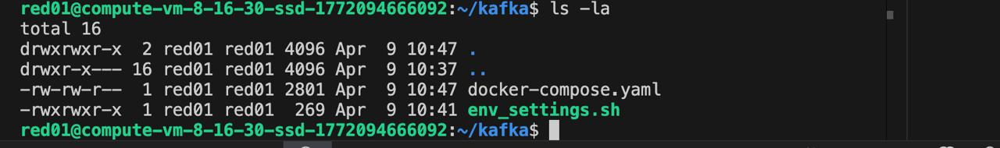

### Файл env_settings.sh

Скрипт автоматически определяет числовой суффикс пользователя из имени (из red01 извлекается 01) и внутренний IP-адрес сервера, после чего записывает их в файл `.env`. Это нужно для того, чтобы у каждого пользвоателя были уникальные имена контейнеров и порты, которые не конфликтуют с другими.

**Параметры в `.env`:**

- `USER_ID` - числовой суффикс пользователя, извлечённый из имени командой `sed 's/red//'`. Используется во всех именах контейнеров и номерах портов.

- `HOST_IP` - внутренний IP-адрес виртуальной машины. Kafka использует его в `ADVERTISED_LISTENERS` - это адрес, который брокер сообщает клиентам для подключения.

- `ZK1_PORT`, `ZK2_PORT`, `ZK3_PORT` - порты трёх zookeeper-узлов на хосте (`2101`, `2201`, `2301` для red01). Формат `21XX`, `22XX`, `23XX` уникален для каждого студента.

- `B1_PORT`, `B2_PORT`, `B3_PORT` - порты трёх Kafka-брокеров на хосте (`9101`, `9201`, `9301` для red01). Формат `91XX`, `92XX`, `93XX`.

- `AKHQ_PORT` - порт веб-интерфейса AKHQ на хосте (`8001` для red01)

**Скрипт запускался командой:**

```
./env_settings.sh
```


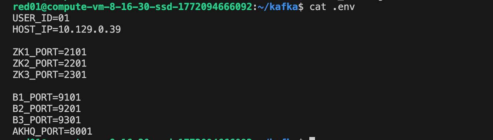

### Файл docker-compose.yaml

Файл описывает 7 сервисов: 3 узла zookeeper, 3 брокера Kafka и веб-интерфейс AKHQ.

zookeeper - это отдельная программа, которая следит за состоянием кластера Kafka: какие брокеры живы, кто является лидером каждой партиции, какие топики существуют. Три узла zookeeper нужны для отказоустойчивости самого zookeeper - кластер продолжает работу пока жива половина узлов плюс один.

**Параметры zookeeper-сервисов:**

- `zookeeper_SERVER_ID` - уникальный идентификатор узла в кластере zookeeper. Каждый из трёх узлов получает свой номер: 1, 2 или 3.

- `zookeeper_CLIENT_PORT` - стандартный порт `2181`, на котором zookeeper принимает подключения от Kafka-брокеров.

- `zookeeper_SERVERS` - список всех трёх узлов с портами для внутренней коммуникации. Порт `2888` используется для репликации данных между узлами, `3888` - для выборов лидера.

**Параметры брокеров Kafka:**

- `KAFKA_BROKER_ID` - уникальный числовой идентификатор брокера (1, 2 или 3). По нему zookeeper и другие брокеры различают узлы кластера.

- `KAFKA_zookeeper_CONNECT` - адреса всех трёх узлов zookeeper. При старте брокер подключается к ним и регистрируется в кластере.

- `KAFKA_LISTENERS` - адрес, на котором брокер слушает входящие подключения внутри контейнера. `PLAINTEXT` означает незашифрованное соединение.

- `KAFKA_ADVERTISED_LISTENERS` - адрес, который брокер сообщает клиентам для подключения. Содержит внешний IP сервера, иначе клиенты за пределами Docker-сети не смогут подключиться.

- `KAFKA_INTER_BROKER_LISTENER_NAME` - тип протокола, который брокеры используют для общения между собой.

AKHQ - веб-интерфейс для администрирования Kafka. В его конфигурации указан `bootstrap.servers` - адрес брокера, к которому AKHQ подключается для получения информации о кластере. 

### Запуск кластера

```
docker compose --env-file .env up -d
```

Флаг `-d` запускает контейнеры в фоновом режиме. Флаг `--env-file .env` передаёт переменные из файла `.env` в docker compose, чтобы подставить уникальные порты и имена.

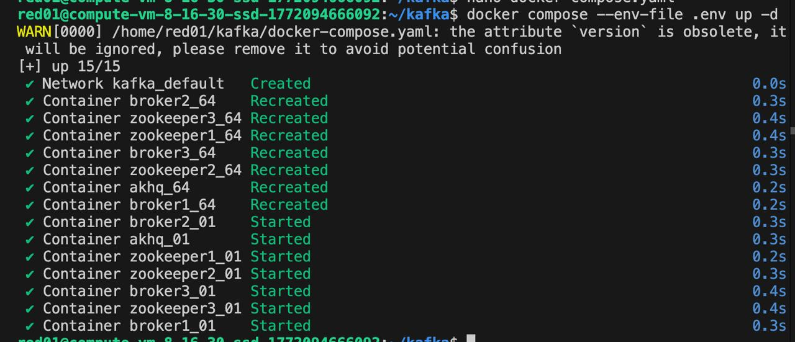

### Проверка запущенных контейнеров:

```
docker ps
```

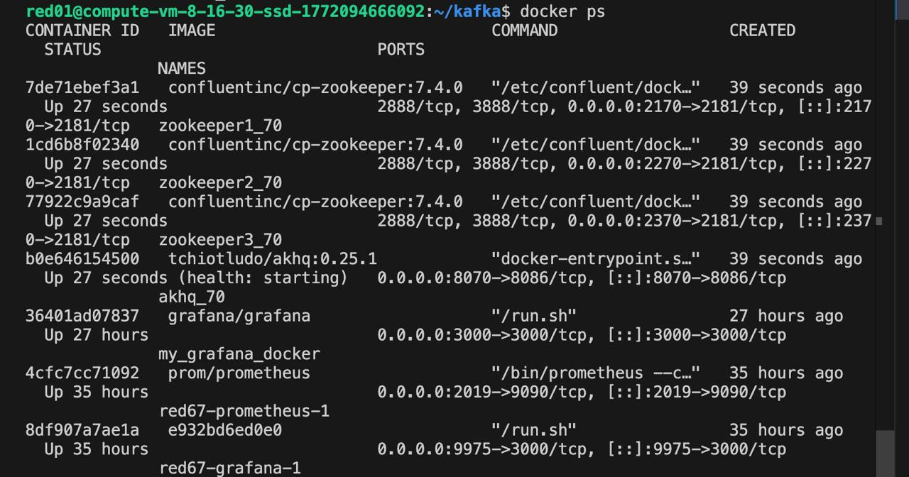

### Веб-интерфейс AKHQ проверен в браузере по адресу `http://178.154.195.14:8001`.

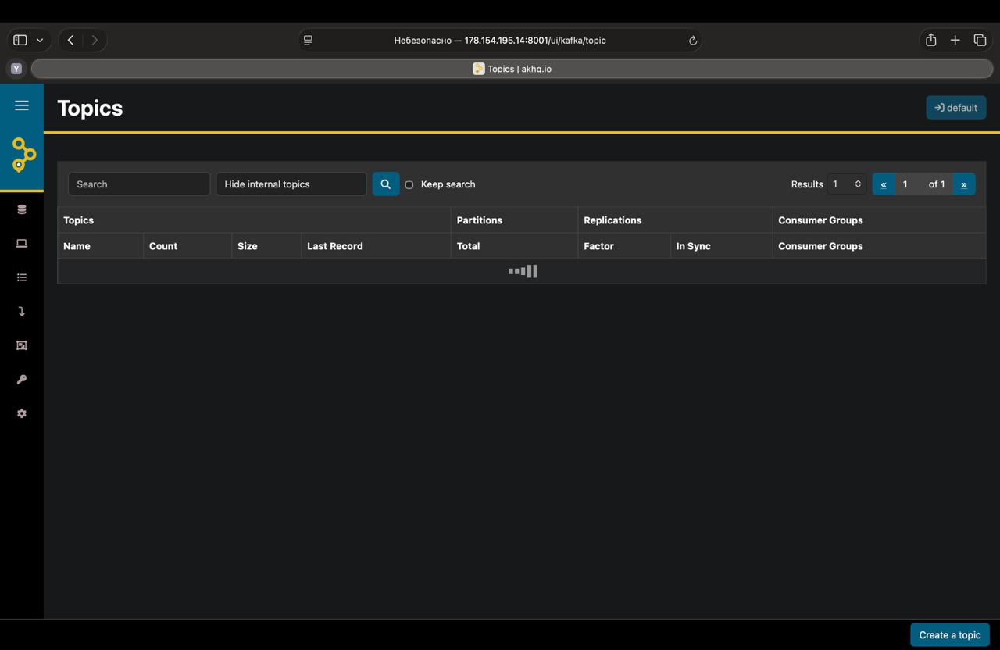

### Создание топика и запуск Producer**

**Подключение к контейнеру брокера 1:**

```
docker exec -it broker1_01 bash
```

Команда `docker exec -it` открывает интерактивную bash-сессию внутри работающего контейнера. Все дальнейшие команды kafka выполняются из окружения самого брокера, где доступны все инструменты Kafka. Внутри Docker-сети брокер доступен по имени контейнера, а не по IP.

**Создание топика `my_topic_01`:**

```
kafka-topics \
  --bootstrap-server broker1:9101 \
  --create \
  --topic my_topic_01 \
  --replication-factor 3 \
  --partitions 50
```

- `--bootstrap-server broker1:9101` - адрес брокера для первоначального подключения. Внутри Docker-сети брокер доступен по имени контейнера `broker1` и порту `9101`.

- `--create` - указывает, что выполняется операция создания топика.

- `--topic my_topic_01` - имя топика. Суффикс `_01` уникален для пользователя red01.

- `--replication-factor 3` - каждая партиция будет скопирована на все 3 брокера. Если один брокер упадёт, данные останутся на двух других.

- `--partitions 50` - топик делится на 50 частей, что позволяет нескольким consumer читать данные параллельно и увеличивает пропускную способность.

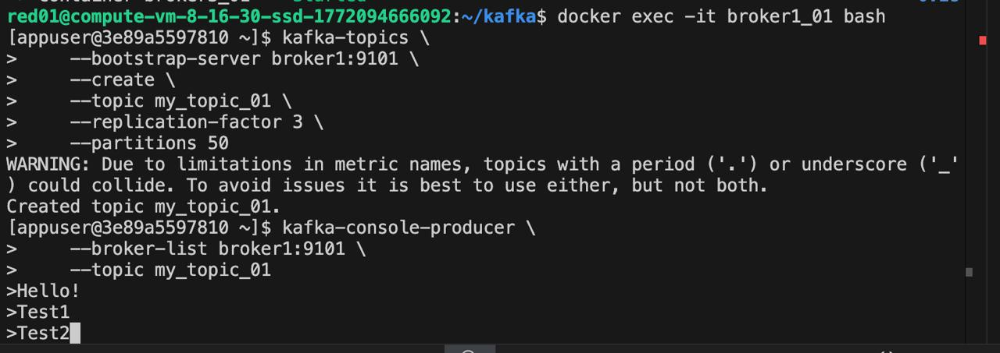

### Запуск Producer:

```
kafka-console-producer \
  --broker-list broker1:9101 \
  --topic my_topic_01
```

`--broker-list broker1:9101` - адрес брокера, к которому подключается producer.

`--topic my_topic_01` - топик, в который отправляются сообщения.

После запуска producer принимает текстовый ввод - каждая строка, подтверждённая Enter, отправляется как отдельное сообщение в топик.


### Запуск Consumer на брокере 2

В новом терминале, не закрывая первый с producer, выполнено подключение к брокеру 2:

```
docker exec -it broker2_01 bash
```

**Запуск Consumer:**

```
kafka-console-consumer \
  --bootstrap-server broker2:9201 \
  --topic my_topic_01 \
  --from-beginning
```

- `--bootstrap-server broker2:9201` - подключение идёт через второй брокер. Это демонстрирует, что данные реплицированы: сообщения отправлялись через broker1, а читаются через broker2, и они там есть.

- `--from-beginning` - читать все сообщения с самого начала, а не только новые. Без этого флага consumer увидел бы только сообщения, отправленные после его запуска.

Consumer вывел все сообщения, отправленные через Producer на первом брокере, что подтверждает корректную работу репликации в кластере.

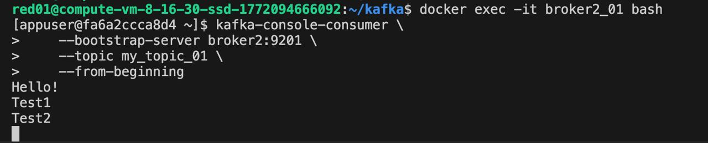

### Проверка топика в AKHQ

В браузере открыт веб-интерфейс AKHQ. В списке топиков отображается `my_topic_01`. Нажата кнопка настроек (шестерёнка) напротив топика для просмотра конфигурации.

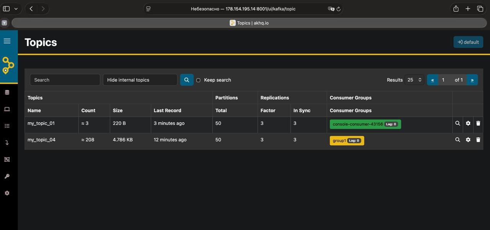

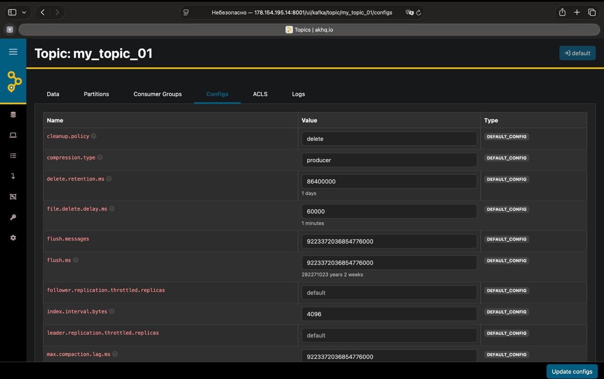

---

## Задание 2. Настройка отказоустойчивости Kafka

### Переконфигурация кластера

В файл `docker-compose.yaml` в секцию `environment` каждого из трёх брокеров добавлены следующие параметры:

```
KAFKA_OFFSETS_TOPIC_REPLICATION_FACTOR: 3
KAFKA_TRANSACTION_STATE_LOG_REPLICATION_FACTOR: 3
KAFKA_TRANSACTION_STATE_LOG_MIN_ISR: 2
KAFKA_MIN_INSYNC_REPLICAS: 2
KAFKA_AUTO_CREATE_TOPICS_ENABLE: "true"
```

- `KAFKA_OFFSETS_TOPIC_REPLICATION_FACTOR: 3` - коэффициент репликации внутреннего топика `__consumer_offsets`, где Kafka хранит позиции всех consumer. Значение 3 означает, что эти данные хранятся на всех трёх брокерах и не потеряются при отказе одного.

- `KAFKA_TRANSACTION_STATE_LOG_REPLICATION_FACTOR: 3` - коэффициент репликации внутреннего топика транзакций. Обеспечивает сохранность данных о транзакциях при отказе брокера.

- `KAFKA_TRANSACTION_STATE_LOG_MIN_ISR: 2` - минимальное количество синхронизированных реплик для транзакционного топика. Транзакция считается успешной только если подтверждены минимум 2 реплики.

- `KAFKA_MIN_INSYNC_REPLICAS: 2` - минимальное число брокеров, которые должны подтвердить запись сообщения. При значении 2 из 3: если остановится один брокер, запись продолжит работу. Если остановятся два - запись прекратится, но чтение останется доступным.

- `KAFKA_AUTO_CREATE_TOPICS_ENABLE: "true"` - разрешает Kafka автоматически создавать топик при первой отправке сообщения, если топик ещё не существует.

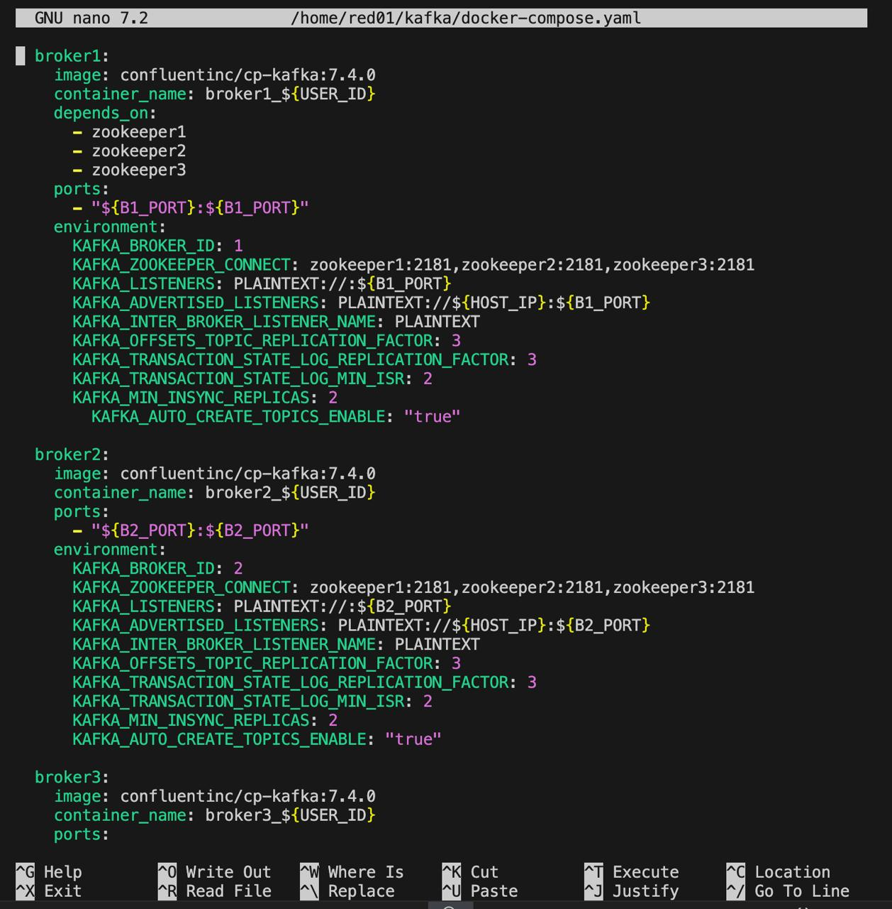

### Перезапуск кластера

```
docker compose down
docker compose --env-file .env up -d
docker ps
```

`docker compose down` останавливает и удаляет все контейнеры. После этого `up -d` создаёт их заново с применёнными настройками. Только так новые параметры из `environment` вступают в силу.

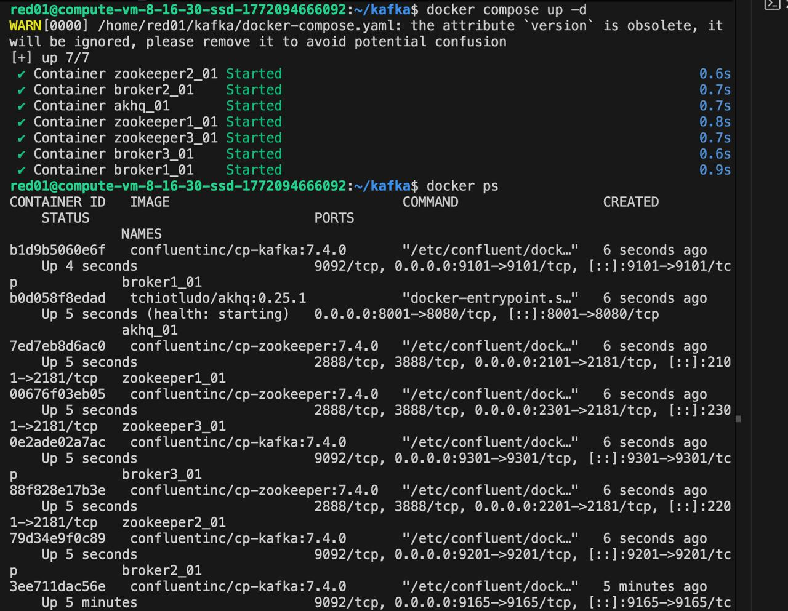

### Создание топика big_topic_01

```
docker exec -it broker1_01 bash
```

```
kafka-topics \
  --bootstrap-server broker1:9101 \
  --create \
  --topic big_topic_01 \
  --partitions 50 \
  --replication-factor 3
```

Топик создаётся уже после применения новых настроек кластера, поэтому на него распространяется требование `min.insync.replicas=2`.

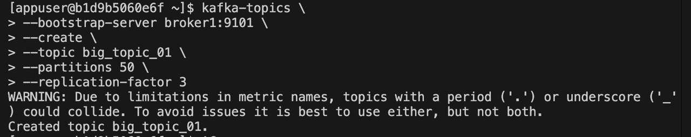

### Проверка конфигурации топика

```
kafka-topics \
  --bootstrap-server broker1:9101 \
  --describe \
  --topic big_topic_01
```

Флаг `--describe` выводит детальную информацию о топике: количество партиций, replication factor, список ISR-реплик и распределение лидеров по брокерам.

В выводе команды наблюдаются: `ReplicationFactor: 3` - каждая партиция хранится на всех 3 брокерах. `Isr: 1,2,3` - все 3 брокера синхронизированы, количество ISR не менее 2, как требует `min.insync.replicas`. Лидеры партиций распределены по всем трём брокерам, что означает равномерную балансировку нагрузки.

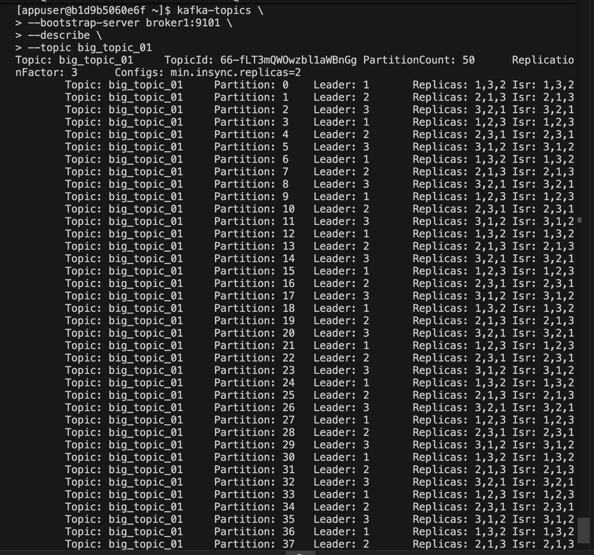

---

## Задание 3. Подключение кастомных Producer и Consumer

### Установка необходимых Python-библиотек

```
pip3 install confluent-kafka python-dotenv
```

`confluent-kafka` - официальная Python-библиотека для работы с Kafka. `python-dotenv` - библиотека для загрузки переменных из файла `.env`. Python-скрипты читают `HOST_IP` и `USER_ID` из этого файла, чтобы знать к каким брокерам подключаться.

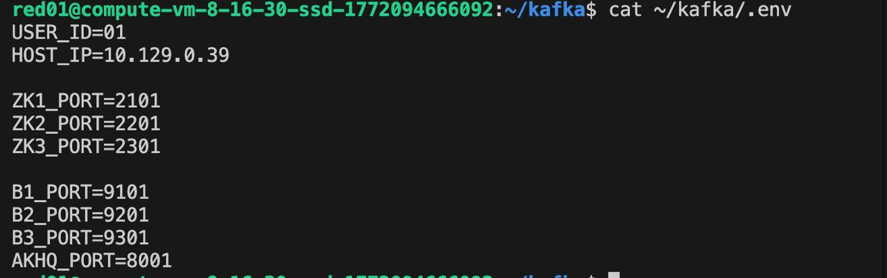

### Producer

Producer отправляет 100 сообщений в топик `my_topic_01` с ключами `key_0` - `key_9`.

**Параметры конфигурации:**

- `bootstrap.servers` - перечислены все три брокера. Если один недоступен, producer подключится к другому.

- `acks: all` - producer ждёт подтверждения от всех ISR-реплик перед тем как считать сообщение доставленным. В связке с `min.insync.replicas=2` гарантирует, что сообщение сохранено минимум на 2 брокерах.

- `linger.ms: 10` - producer ждёт 10 мс перед отправкой, собирая несколько сообщений в один батч. Уменьшает количество сетевых запросов и повышает пропускную способность.

- `enable.idempotence: True` - гарантирует, что каждое сообщение будет записано ровно один раз, даже при повторных попытках отправки после сбоя сети.

- `max.in.flight.requests.per.connection: 5` - максимум 5 неподтверждённых запросов одновременно. При включённой идемпотентности значение не должно превышать 5.

- `compression.type: lz4` - сжатие батча сообщений. Уменьшает объём передаваемых данных и снижает нагрузку на сеть.

- `batch.size: 32 * 1024` - максимальный размер батча 32 КБ. Producer отправляет батч когда он заполнен или истёк `linger.ms`.

- `client.id: producer_red01` - идентификатор producer. Отображается в логах и метриках Kafka, полезен для диагностики.

**Запуск producer.py**

```
python3 producer.py
```

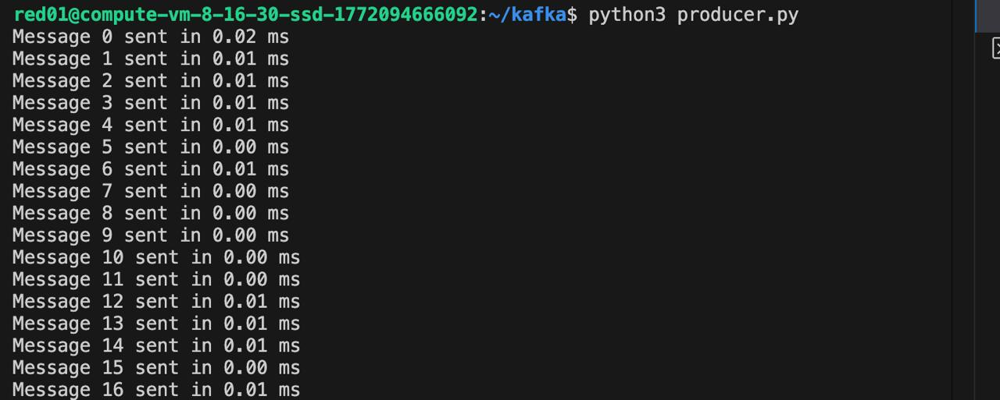

**Consumer**

**Параметры конфигурации:**

- `group.id` - идентификатор группы потребителей. Consumer в одной группе делят партиции топика между собой: каждая партиция читается только одним consumer из группы.

- `auto.offset.reset: earliest` - при первом подключении начинать читать с самого первого сообщения в топике.

- `enable.auto.commit: False` - отключает автоматическое подтверждение прочитанных сообщений. Consumer вручную вызывает `commit()` после обработки, что исключает потерю сообщений при сбое во время обработки.

- `session.timeout.ms: 30000` - если брокер не получает сигнал от consumer в течение 30 секунд, он считает его упавшим и перераспределяет его партиции на других consumer группы.

- `heartbeat.interval.ms: 5000` - как часто consumer отправляет сигнал живости брокеру. Должно быть меньше `session.timeout.ms`.

- `max.poll.interval.ms: 60000` - максимальное время обработки одного батча сообщений. Если consumer не вызовет `poll()` в течение 60 секунд, он будет исключён из группы.

**Запуск producer.py**

```
python3 consumer.py group1 consumer1
```

Аргументы `group1` и `consumer1` - это `group_id` и `client_id`.

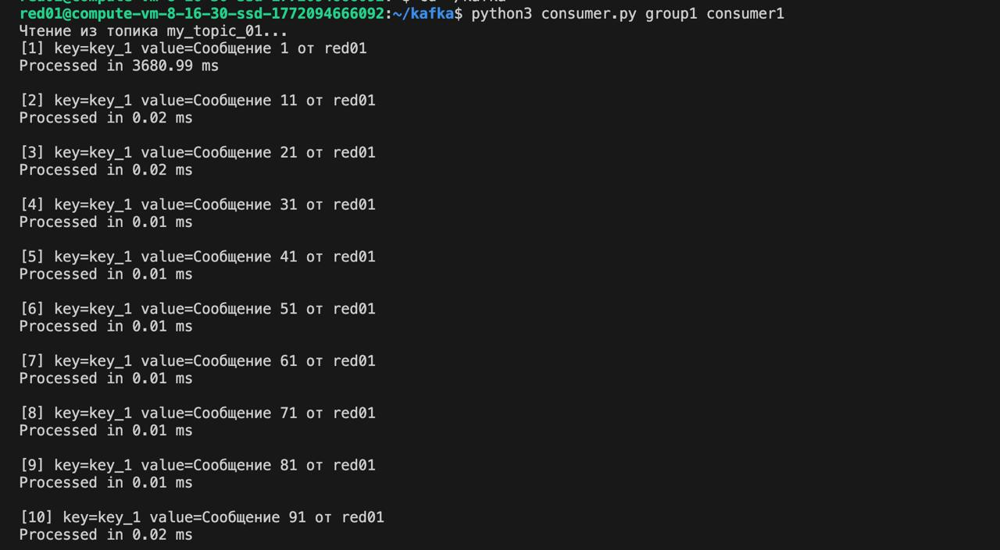

---

## Ответы на контрольные вопросы

**1. Что означает параметр replication.factor в Kafka и зачем он нужен?**

`replication.factor` определяет, на скольких брокерах хранится копия каждой партиции топика. При значении 3 данные каждой партиции присутствуют на всех трёх брокерах. Если один брокер выходит из строя, данные остаются доступны на двух оставшихся. Без репликации потеря брокера означает потерю части данных.

**2. Какую роль играет параметр min.insync.replicas и как он влияет на надёжность записи?**

`min.insync.replicas` задаёт минимальное количество брокеров, которые должны подтвердить запись, чтобы она считалась успешной. При значении 2 запись считается доставленной только если её приняли минимум 2 брокера. Это защищает от ситуации, когда сообщение записалось на один брокер, а тот упал до репликации, и данные потерялись.

**3. Почему в producer используется настройка acks=all и как она связана с min.insync.replicas?**

`acks=all` означает, что producer ждёт подтверждения от всех брокеров в ISR. `min.insync.replicas=2` определяет, сколько брокеров должно быть в ISR для успешной записи. Их совместное использование даёт гарантию, что сообщение не потеряется даже если один брокер упадёт сразу после записи, тк копия уже есть на втором брокере.

**4. Зачем в Kafka-кластере используется несколько брокеров?**

Несколько брокеров решают две задачи. 1. Отказоустойчивость: при выходе из строя одного брокера кластер продолжает работу, данные сохранены на остальных. 2. Масштабирование: партиции топика распределяются по брокерам, что позволяет параллельно обрабатывать запросы и увеличивать пропускную способность за счёт добавления новых брокеров.

**5. Почему внутри контейнера Kafka нужно подключаться к брокеру по имени broker1:9101, а не через localhost?**

Каждый Docker-контейнер - это изолированная среда со своей сетью. `localhost` внутри контейнера указывает на сам этот контейнер, а не на другой. Docker создаёт внутреннюю DNS-сеть, в которой контейнеры видят друг друга по именам. Имя контейнера `broker1` преобразуется в его внутренний IP-адрес в сети Docker.

**6. Что такое partition в Kafka и зачем создавался топик с 50 партициями?**

Партиция - это файл, куда сообщения пишутся одно за другим в том порядке, в котором пришли. Kafka гарантирует, что внутри одной партиции порядок сообщений всегда сохраняется.. Топик из 50 партиций позволяет одновременно читать данные 50 consumer из одной группы параллельно, что кратно увеличивает пропускную способность. При записи партиции также распределяются по разным брокерам, балансируя нагрузку. Чем больше партиций, тем больше пользователей могут читать данные одновременно, но при этом ZooKeeper и брокеры потребляют больше ресурсов.

**7. Как Kafka распределяет сообщения по партициям и какую роль играет ключ сообщения?**

Если у сообщения есть ключ, Kafka вычисляет `hash(key) % количество_партиций` и отправляет сообщение в соответствующую партицию. Все сообщения с одинаковым ключом всегда попадают в одну партицию - это гарантирует их порядок. В нашем задании использовались ключи `key_0` - `key_9`. Если ключ не указан, Kafka распределяет сообщения по партициям по кругу.

**8. Что означает поле ISR (In-Sync Replicas) в выводе команды kafka-topics --describe?**

ISR - список брокеров, чьи реплики данной партиции актуальны и синхронизированы с лидером. Брокер попадает в ISR только если не отстаёт от лидера по сообщениям. Если брокер падает или начинает отставать, он исключается из ISR. Именно по количеству узлов в ISR Kafka проверяет выполнение условия `min.insync.replicas` при каждой записи.

**9. Что произойдёт, если один брокер остановить при replication.factor=3, min.insync.replicas=2?**

Если один брокер из трёх упадёт, кластер продолжит работать в обоих направлениях. Новые сообщения будут приниматься, потому что останутся 2 живых брокера, что равно значению `min.insync.replicas=2`, условие выполнено. Старые сообщения будут читаться, потому что создана реплика данных на все 3 брокера, поэтому на двух оставшихся все сообщения сохранены. Если остановить два брокера - запись прекратится, так как ISR станет меньше 2 и условие `min.insync.replicas` не будет выполнено. Однако чтение старых данных с оставшегося брокера останется доступным.
