# Отчёт: Логирование и мониторинг
- Логин: red01
---

## Prometheus

### 1. Содержимое рабочей папки

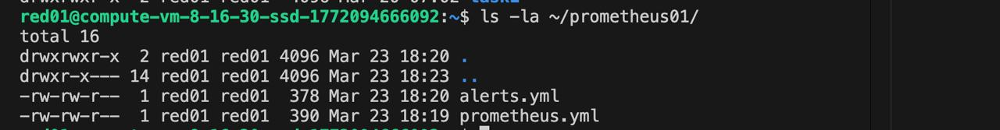

### 2. Содержимое файла prometheus.yml

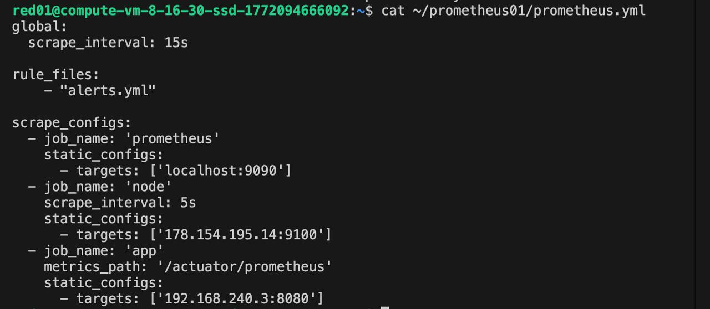

### 3. Содержимое файла alerts.yml

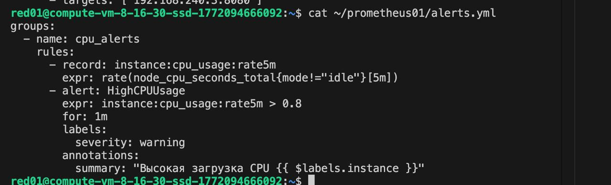

### 4. Статус node_exporter

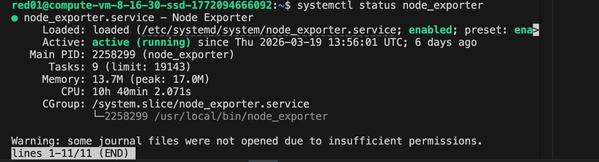

### 5. Запуск контейнера Prometheus

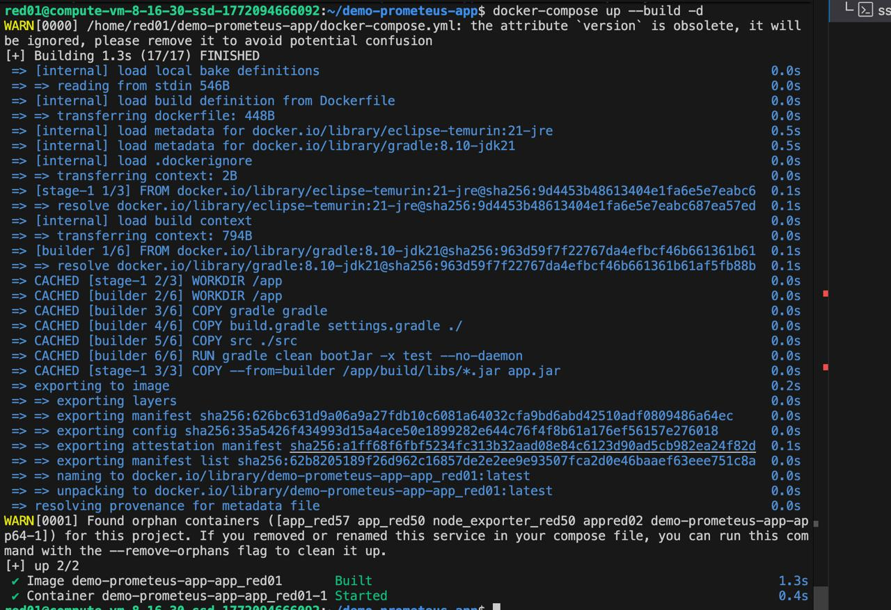

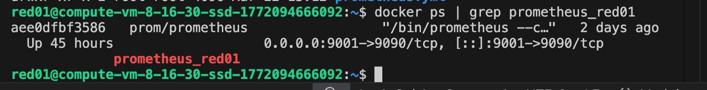

Использовала для себя порт 8101, так как порт 3001 был уже занят
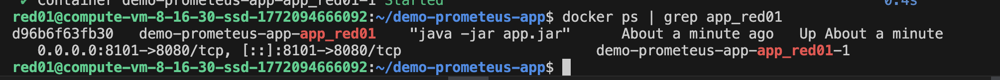

### 7. Веб-интерфейс Prometheus

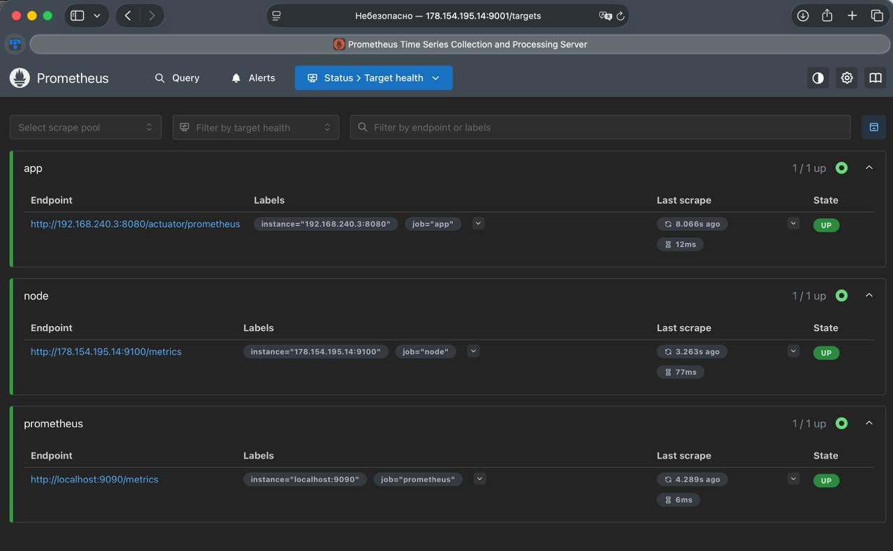

---

## Grafana

### 9. Содержимое папки grafana

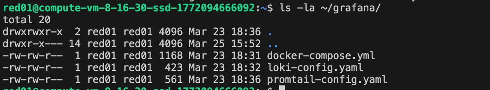

### 10. Содержимое файла docker-compose.yml
Использовала для себя порт 3101, так как порт 3001 был уже занят

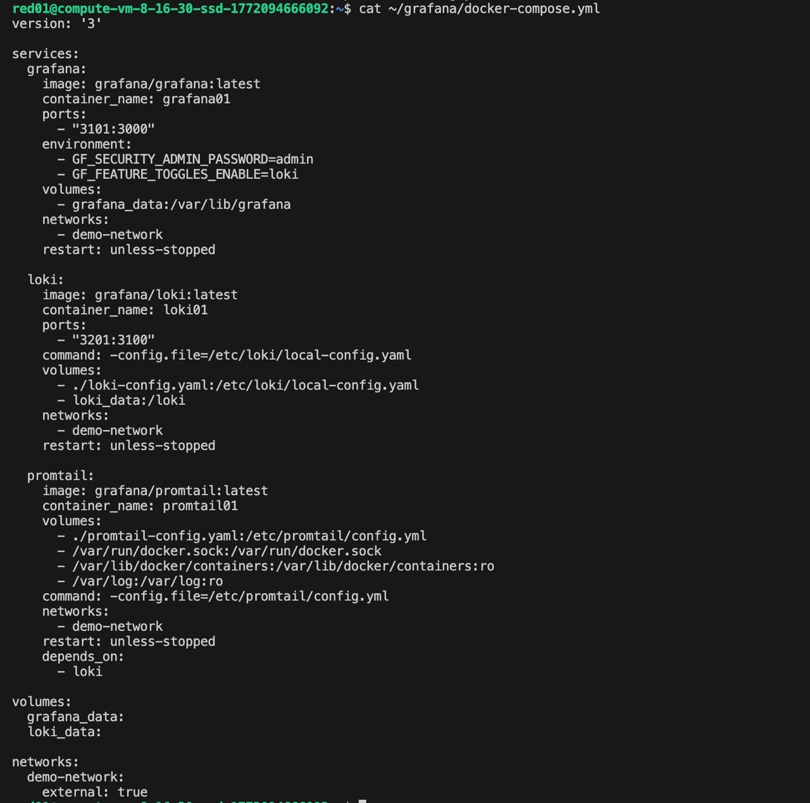

### 11. Содержимое файла loki-config.yaml

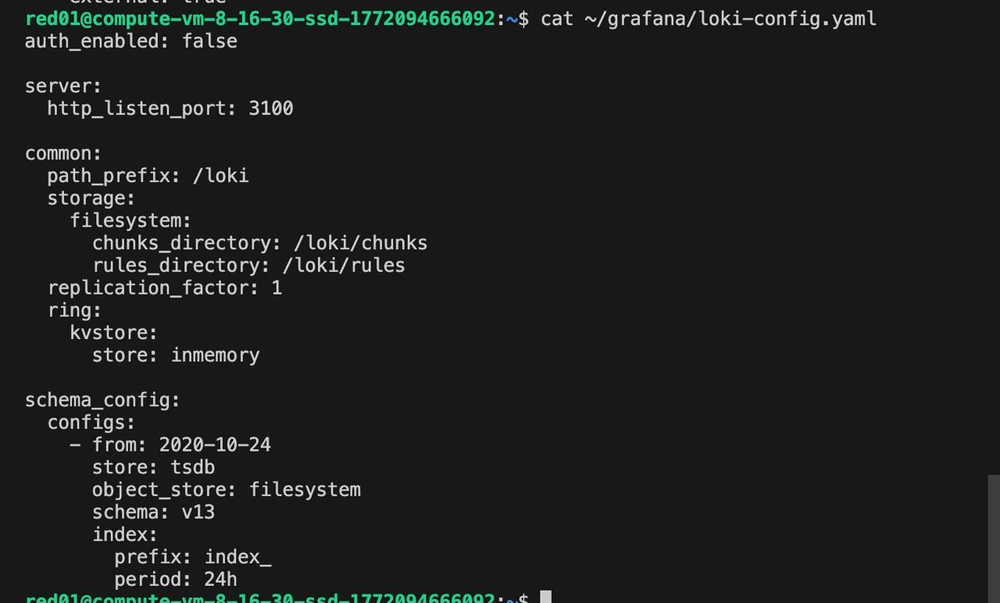

### 12. Содержимое файла promtail-config.yaml

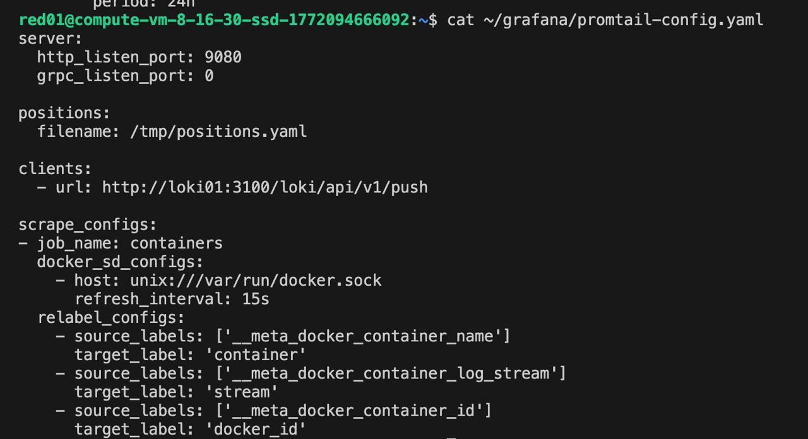

### 13. Запуск контейнера Grafana

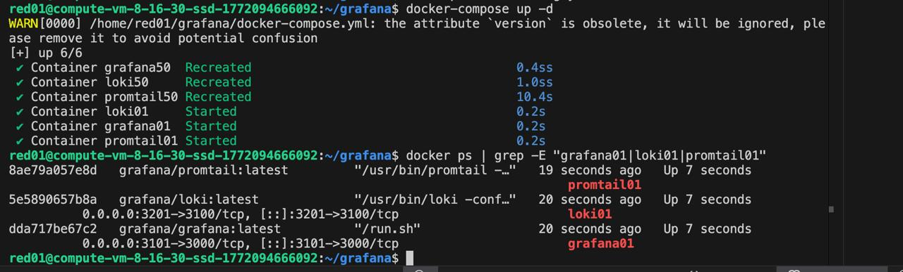

### 14. Веб-интерфейс Grafana

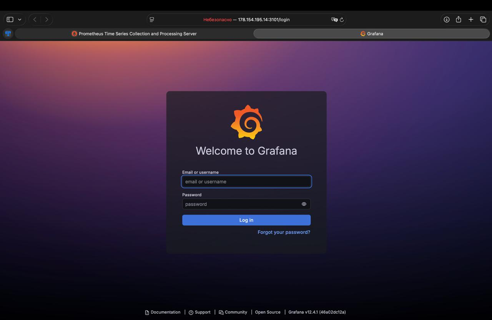
