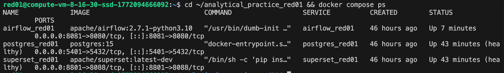
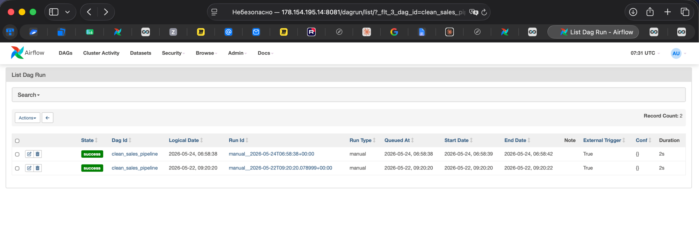
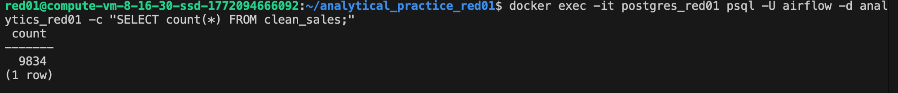
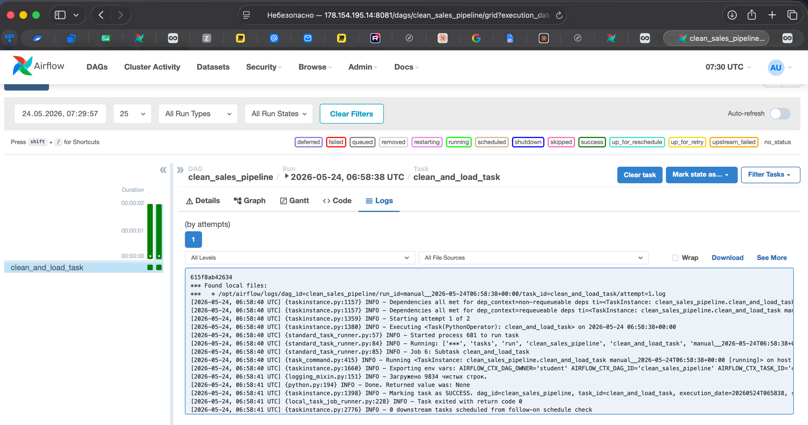
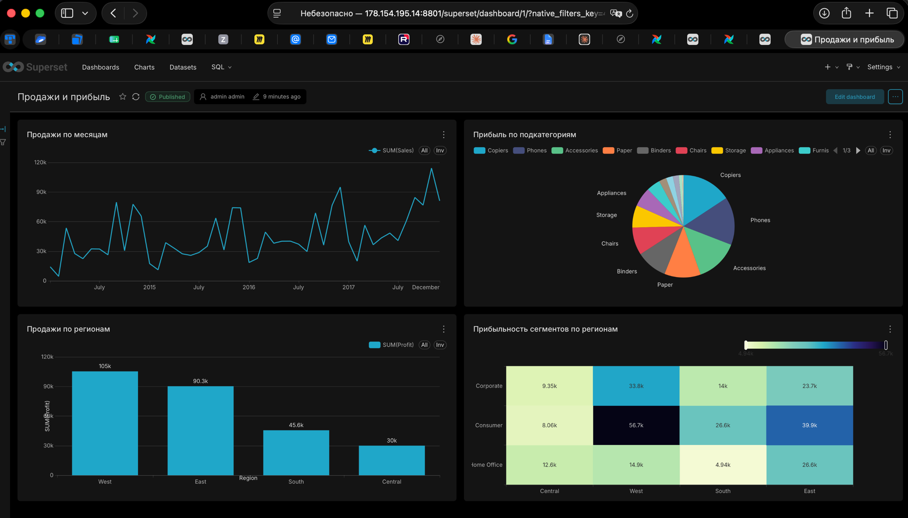

# Отчёт по практике: Построение аналитической системы

**Пользователь:** red01 (Нарышкина Анна Андреевна)

---

## Цель практики

- Развернуть аналитическую инфраструктуру (Postgres, Airflow, Superset) в Docker-контейнерах.
- Освоить автоматическую очистку и трансформацию сырых данных с помощью Python и Airflow.
- Построить бизнес-дашборд на основе подготовленных данных в BI-системе.

---

## Описание выполненных шагов

### Шаг 1. Подключение к виртуальной машине

Подключение по SSH с MacOS к виртуальной машине Ubuntu (`178.154.195.14`) под пользователем `red01`.

### Шаг 2. Проверка Docker

Docker и Docker Compose были предустановлены администратором. Проверка наличия:
- `docker --version`
- `docker compose version`

### Шаг 3. Структура проекта

Создана рабочая директория `~/analytical_practice_red01` с подпапками `dags`, `logs`, `plugins`, `datasets`. Файл `sales.csv` скопирован в `datasets/`. Подпапкам логов выданы права `777`, чтобы Airflow внутри контейнера мог в них писать.

Назначенные порты для пользователя `red01`:
- Postgres: `5401`
- Airflow: `8081`
- Superset: `8801`

### Шаг 4. Развёртывание стека

В `docker-compose.yaml` описаны три сервиса:
- **postgres_red01** — хранилище данных (DWH). База `analytics_red01`, логин/пароль `airflow/airflow`.
- **airflow_red01** — ETL-платформа. Подключена к Postgres для метаданных, папки `dags`, `datasets`, `logs` пробрасываются внутрь контейнера.
- **superset_red01** — BI-система. Создаёт admin-пользователя при первом запуске.

Все три контейнера запускаются одной командой `docker compose up -d` и работают в общей Docker-сети `analytics_network_red01`. Postgres имеет healthcheck — Airflow и Superset стартуют только после того, как БД готова принимать подключения.



### Шаг 5. Проверка доступа в интерфейсы

- **Airflow:** http://178.154.195.14:8081 — логин `admin`, пароль сгенерирован Airflow автоматически и получен командой `docker exec airflow_red01 cat /opt/airflow/standalone_admin_password.txt`.
- **Superset:** http://178.154.195.14:8801 — логин `admin`, пароль `admin_red01`.

### Шаг 6. Создание DAG-файла

В `dags/clean_sales_data.py` написан Python-скрипт ETL-пайплайна `clean_sales_pipeline`, состоящий из одной задачи `clean_and_load_task`:

1. **Extract** — чтение `sales.csv` из `/opt/airflow/datasets/` в pandas DataFrame.
2. **Transform** — очистка данных:
   - удаление полных дубликатов строк (`drop_duplicates`);
   - удаление строк с пустой датой и приведение `Order Date` к формату `datetime`;
   - заполнение пропусков в `Sales` медианным значением;
   - преобразование `Quantity` в число с заменой `'missing'` на `1`;
   - переименование колонок: пробелы и дефисы заменены на `_` для совместимости с SQL.
3. **Load** — загрузка очищенных данных в таблицу `clean_sales` базы `analytics_red01` через SQLAlchemy. Используется `if_exists='replace'` — таблица пересоздаётся при каждом запуске.

DAG настроен на ручной запуск (`schedule_interval=None`), без догоняющих запусков (`catchup=False`), с одной повторной попыткой в случае ошибки.

### Шаг 7. Выполнение DAG

DAG запущен через веб-интерфейс Airflow (Trigger DAG). Статус выполнения — `success`, длительность — 2 секунды.



### Шаг 8. Проверка данных в БД

Проверка количества загруженных строк через `psql` внутри контейнера Postgres:

```bash
docker exec -it postgres_red01 psql -U airflow -d analytics_red01 -c "SELECT count(*) FROM clean_sales;"
```

В таблицу `clean_sales` загружено **9834 строки** — совпадает с числом, выведенным в логах Airflow.



Логи задачи `clean_and_load_task` в Airflow — видна строка `INFO - Загружено 9834 чистых строк`:



### Шаги 9–10. Подключение Superset к Postgres и создание датасета

В Superset настроено подключение к Postgres (Host: `178.154.195.14`, Port: `5401`, Database: `analytics_red01`, Username/Password: `airflow/airflow`). На основе таблицы `public.clean_sales` создан датасет `clean_sales`.

### Шаги 11–12. Создание графиков и дашборда

На дашборде «Продажи и прибыль» размещено 4 визуализации:

| Название | Тип | Поля |
|---|---|---|
| Продажи по месяцам | Line Chart | X: `Order_Date` (по месяцам), Y: `SUM(Sales)` |
| Прибыль по подкатегориям | Pie Chart | Hierarchy: `Sub_Category`, Metric: `SUM(Profit)` |
| Продажи по регионам | Bar Chart | X: `Region`, Y: `SUM(Profit)` |
| Прибыльность сегментов по регионам | Heatmap | X: `Region`, Y: `Segment`, Metric: `SUM(Profit)` |



---

## Бизнес-выводы по данным дашборда

1. **Регион West — лидер по прибыли (≈105k), Central — аутсайдер (≈30k).** Прибыль в West более чем в три раза превышает прибыль Central, несмотря на сопоставимые объёмы продаж. Это говорит о существенных различиях в марже либо в структуре скидок между регионами — стоит проанализировать политику скидок и наценок в Central.

2. **Сегмент Consumer в West — самая прибыльная комбинация (56.7k).** Тепловая карта показывает, что сегмент Consumer стабильно даёт наибольшую прибыль во всех регионах, кроме Central, где лидирует Corporate. Худшая комбинация — Home Office в South (4.94k). Рекомендация: усилить маркетинг Consumer-сегмента в Central и пересмотреть присутствие Home Office в South.

3. **Сезонная цикличность продаж — пики в ноябре-декабре, провалы в январе-феврале.** Линейный график за 2014–2017 годы показывает чёткий повторяющийся паттерн: продажи проседают в начале года и достигают максимума в конце. Рекомендация: запускать маркетинговые акции и сезонные распродажи в январе-феврале, чтобы сгладить провал и повысить общую выручку.

4. **Топ-3 категории по прибыли: Copiers, Phones, Accessories.** Эти три подкатегории формируют большую часть прибыли. Стоит проверить, нет ли подкатегорий с отрицательной прибылью (на круговой диаграмме они отображаются как минимальные сектора) — кандидаты на пересмотр ассортимента и скидочной политики.

---

## Что освоено в ходе практики

- Развёртывание многосервисной инфраструктуры через Docker Compose с настройкой healthchecks, томов и общей сети.
- Автоматизация ETL-обработки данных с помощью пайплайнов в Apache Airflow: разбор сырого CSV, очистка с pandas, загрузка в PostgreSQL через SQLAlchemy.
- Подключение BI-платформы (Apache Superset) к источнику данных, создание датасетов и построение различных типов визуализаций (Bar, Line, Pie, Heatmap).
- Сборка интерактивного дашборда и формулировка бизнес-выводов на основе агрегированных данных.
